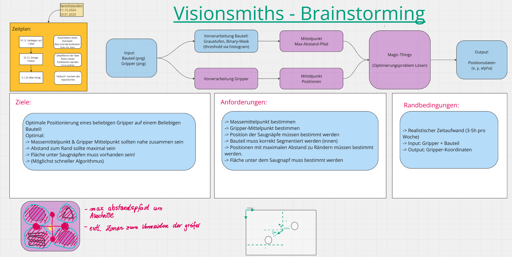
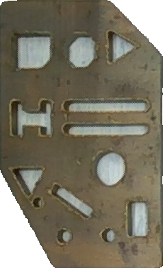
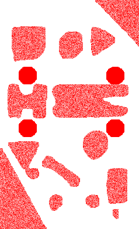

# PROKI Hackathon 2024 - Submission of Group Visionsmiths

## The Challenge
The challenge was presented during the kick-off meeting. In short, the task is to find a good position and rotation for a robotic arm to grab a piece of cut sheet metal.


# Team Members

<table border="1" cellpadding="10" cellspacing="0">
  <tr>
    <td><strong>Jonas Kyrion</strong></td>
    <td></td>
    <td rowspan="4"></td>
  </tr>
  <tr>
    <td><strong>Jonas Ludwig</strong></td>
    <td></td>
  </tr>
  <tr>
    <td><strong>Manuel Westermann</strong></td>
    <td></td>
  </tr>
  <tr>
    <td><strong>Meret Götzmann</strong></td>
    <td></td>
  </tr>
</table>


## Documentation

### 1. Brain storming strategy



### 2. Preprocessing Part-Image

The sheet metal part will be fed into a preprocess pipeline containing the follwoing steps:

    1. pre-segementation using the ultalytic fast-sam.

[More info to fast-sam here](https://github.com/ultralytics/ultralytics/blob/main/docs/en/models/fast-sam.md)

    2. Gaussian blur. 

    3. Determine dynymic thresholds for a canny detector via otsu's method.

    4. morphological operations to close edegs and remove noise from the image.

    5. Afterwards find the shape & the image center via the open-CV moments method. This will be used to apped the processed gripper to the right dimensions.


### 3. Preprocessing Gripper Images
This script processes gripper images through a pipeline to prepare them for further analysis. The pipeline includes the following steps:

    1. Binary Image Conversion: Convert the input image to grayscale and apply Otsu's method for thresholding to obtain a binary image.

    2. Center of Mass Calculation: Use OpenCV's moments method to compute the center of mass of the binary image.

    3. Dynamic Resizing: Expand the binary image symmetrically to match target dimensions by adding borders.

    4. Optional Visualization: Display intermediate images and dimensions for debugging purposes.

This processed output ensures the gripper images are standardized for further applications.


### 4. Optimization 

This script optimizes the alignment of a template image with a reference image by adjusting affine transformation parameters. The optimization process includes the following steps:

    1. Objective Function Definition: Define an objective function that minimizes the error between the transformed template's center and the target coordinates.

    2. Constraint Handling: Implement a constraint function such that the gripper will avoid the boundaries of the sheet metal part. 

    3. Affine Transformation Application: Use PyTorch to apply affine transformations, including rotation and translation, to the template image during optimization.

    4. Gradient-Based Optimization: Utilize the scipy.optimize.minimize method with gradient-based constraints and bounds to find the optimal transformation parameters.

    5. Optional Visualization: Provide optional visualization of intermediate and final alignment results, including overlays of the template and reference images.

The script outputs optimized transformation parameters and optionally generates visualization files, ensuring accurate and efficient alignment of template images for further analysis.


# How to Run
- **! IMPORTANT !**   

    Navigate to the `solution directory` ../solution/

- Run this code in bash:

    `python csvBuilder.py input.csv output.csv`

- An example input.csv could look like this and the default delimiter is ';' . 
    
    
    ```csv
    part;gripper
    ../data/dummy/part_1/part_1.png;../data/dummy/part_1/gripper_2.png
    ../data/dummy/part_2/part_2.png;../data/dummy/part_2/gripper_1.png

- If you used ',' it must be specified in:

    `generate_results(input_csv_path, output_folder_path, delimiter=',')`

- The the data will be saved in the `output.csv` and there will be generated visulatizations in the solution directory.

- The terminal will also print your specific `output_path` like: 

    `Output folder:  'path_to_your' /PROKI-Hackathon-Visionsmiths solution/solution_part_2.png`


## Example Solutions 

 


 

## License

All resources in this repository are licensed under the MIT License. See the [LICENSE](LICENSE) for more information.


## Acknowledgments


This project is partially funded by the German Federal Ministry of Education and Research (BMBF) within the “The Future of Value Creation – Research on Production, Services and Work” program (funding number 02L19C150) managed by the Project Management Agency Karlsruhe (PTKA).
The authors are responsible for the content of this publication.
